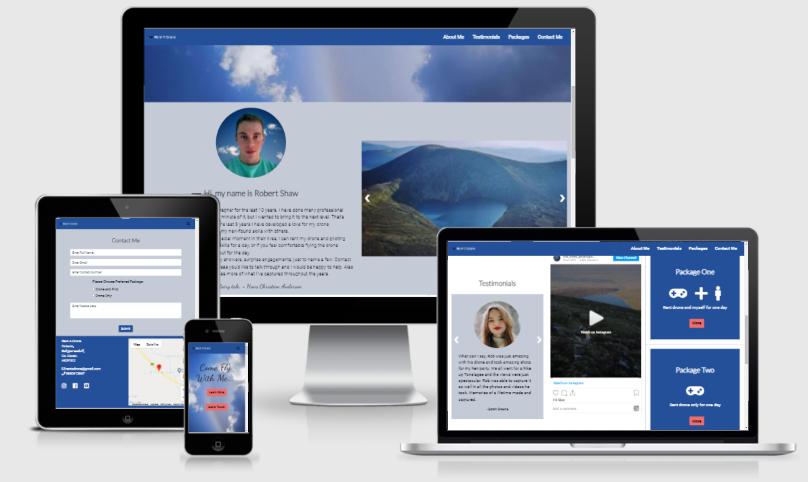
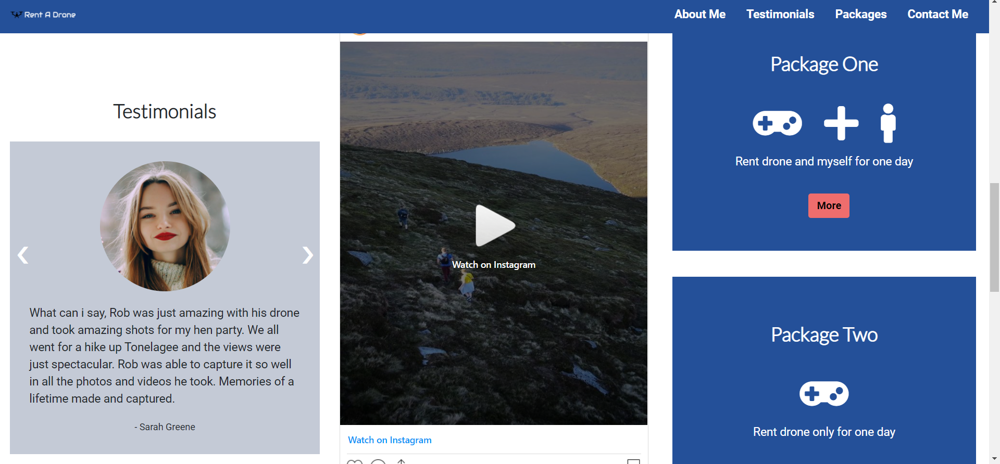

# Rent A Drone

[Link to Website](https://rcass172.github.io/rent-a-drone/)

---

## **Table Of Contents**
 - [Introduction](#introduction)
 - [User Goals](#user-goals)
 - [Business Owner Goals](#business-owner-goals)
 - [User Stories](#user-stories)
 - [Design](#design)
 - [Features](#features)
 - [Technologies Used](#technologies-used)
 - [Testing](#testing)
 - [Deployment](#deployment)
 - [Credits](#credits)
 - [Acknowledgements](#acknowledgements)

 ---

# **Introduction**

Rent A Drone is a business website showcasing a photographers service of hiring his drone to capture professional photographs and videos for customers. The inspiration for the website came from a friend who had this business idea in mind and wanted me to bring it to life.

The primary goal is to show all relevant information to a user in an appealing way with an easy to use, responsive website. As the business owner is primarily on Instagram, I decided to embed a video from the Instagram account to encourage the user to connect via social media and increase brand awareness.

The website has been created using a simple design and use of JavaScript interactivity to avoid too much information being shown to the user all at once, which can make the page feel too busy. A responsive contact form is also provided to ensure users have a clear way to contact the business and all emails are sent directly to the business owner, which will in turn create bookings.

## **User Goals**

As a customer I would like:

* An easy to navigate website
* A website that is responsive on all devices i.e mobile/tablet/desktop
* Relevant content throughout 
* A visually appealing website that stands out
* To be able to find testimonials from previous users 
* To see photographs and videos that showcase business portfolio
* To be able to contact the business easily

## **Business Owner Goals**

As a business owner I would like:

* To raise awareness of the service I provide
* To stand out from competitors with an appealing website
* Showcase photographs and videos to show what is provided
* Increase bookings with call to action buttons 
* A professional and responsive website
* Contact details and location to be shown
* Social media links to be included
* A contact form to receive emails from interested customers

## **User Stories**

1. I would like a simple yet professional looking website that is visually appealing
2. I would like to be able to view the website on any device
3. I should be able to easily navigate throughout the website 
4. Contact details for the business should be easy to find
5. I would like to be able to see previous work done
6. I would like a clear explanation of what services are provided
7. Testimonials of previous customers should be provided
8. Social media links should be provided for more information
9. A map with the business location so it's easy to find
10. To learn about the business
11. Any links clicked should open in a new tab
12. I would like to be able to tell if the service provided is reliable

---

# **Design**

* Hero Image - The sky photograph used for the hero image was chosen to relate to the service provided
* Colors - From the hero image the blue was taken and used for the navigation bar and footer. The off-white was taken from the clouds to use as a background color in sections and then a white for the alternate sections to create a nice flow and match in with the sky theme of the hero image
* Fonts - I used the Lato and Roboto fonts throughout the website which both match well together with a fallback font of sans-serif. I also used a cursive font, dancing script for the text on the hero image to create a more personal and fun touch when the user first arrives to the website. These were integrated into the website using [Google Fonts](https://fonts.google.com/)
* Logo - The business logo was created on the website [Free Logo Design](https://www.freelogodesign.org/) which is used on the navigation bar and made clickable to send user back to top of page
* Wireframes - Balsamiq was used to show the initial wireframes I had created for the website on the three devices mobile/tablet/desktop 
  * [View Mobile Here](https://github.com/RCass172/rent-a-drone/blob/master/assets/wireframes/wireframeMobile.png)
  * [View Tablet Here](https://github.com/RCass172/rent-a-drone/blob/master/assets/wireframes/wireframeTablet.png)

  

---

# **Features**

## Navigation Bar

As the website is on the one page, bootstraps scrollspy is used to show a user exactly where they are on the page and lets them navigate easily from one section to another, which makes for a simpler navigation throughout the page

## Hero Image

This is used to fill up the entire browser window on entering for a visually appealing website and to grab the user's attention. Two call to action buttons are present, a contact button primarily aimed at returning users who have visited the website before and want to go ahead and contact the business. A find out more button is aimed at new users visiting the website who are looking for more information before they contact the business

## About Me Section

This has a profile picture of the business owner, which gives the user a personal and trusting feeling towards the business and shows that the owner is a real person. A call to action button is found underneath for the user to find out more about the business and service provided. This is to limit too much text on the website initially which can look messy an unappealing to the user

## Image Section

After the user reading about the owner and service provided they can have a look at the photographs provided to showcase the business owner's portfolio. This is valuable to the user as they can see if they like what is provided. The user can click on the arrows to easily move between the photographs

## Testimonial Section

This provides a photograph and text from previous users which new users will find valuable in finding out more about the service and whether the business is reliable and trustworthy. Users can easily click through the different testimonials using the arrows provided

## Instagram video 

I have embedded the video from the business owner's Instagram to showcase again more of their portfolio. On clicking the video it will open up in a new tab which will allow the user to watch other relevant videos from the Instagram account and allows the user to connect with the business via social media

## Packages Section

This contains exactly what services are provided along with the cost which is highly valuable to the user to help decide which package better suits their needs. In my initial wireframe I had them as a slideshow to be able to click through, however I felt it better having both on display as there were only two options and easier for the user to see both at first glance when on larger devices

## Contact Section

This form allows the user to easily get in contact with the business owner by sending an email straight to the business. They can specify which package they are interested in to give the business owner as much information as possible. The email is sent directly to the owner once the user clicks the submit button by using the Emailjs API 

## Footer Section

This contains all the contact information and social media links which open to a new tab so access to the website is not lost. This encourages the user to connect via the social media links which increases brand awareness. The Google map API was used to show a map with a marker of where the business is located so the user can easily locate where to find them

---

# **Technologies Used**

## Languages

* [HTML](https://en.wikipedia.org/wiki/HTML)
* [CSS](https://en.wikipedia.org/wiki/CSS)
* [JavaScript](https://en.wikipedia.org/wiki/JavaScript)

## Libraries/Frameworks/Tools

* [Bootstrap v4.6](https://getbootstrap.com/docs/4.6/getting-started/introduction/) - used for responsive pages  
* [TinyPNG](https://tinypng.com/) - used to compress images for better performance
* [Image Optim](https://imageoptim.com/online) - used to optimise images further to load faster
* [Fontawesome](https://fontawesome.com/)- used for the aesthetics 
* [Google Fonts](https://fonts.google.com/) - Lato/Roboto/Dancing Script was used on website, imported to the style.css file
* [Google Map API](https://developers.google.com/maps/documentation/javascript/overview) - used in the footer of website to show an interactive map location of the business using a marker, Google maps documentation used as reference
* [EmailJs](https://www.emailjs.com/) - used for the contact form to send emails directly to business owner
* [Balsamiq](https://balsamiq.com/) - used to create wireframes
* [Favicon](https://favicon.io/favicon-converter/) - used to create the icons used throughout
* [Git](https://git-scm.com/) - used for version control
* [Gitpod](https://www.gitpod.io/) - used to write code before pushing to GitHub for storage

---

# **Testing**

Click [here](testing.md) for the testing process 

---

# **Deployment**

This project was deployed to GitHub pages by executing the following steps:

1. Open GitHub and find relevant [repository](https://github.com/RCass172/rent-a-drone/).
2. Navigate to the settings tab and scroll down to pages.
3. Under source heading click the none dropdown and select <b>master branch</b> and save.
4. When page refreshes the website is now live and found when you click settings > pages > Your site is published at [link](https://rcass172.github.io/rent-a-drone/)

To run project locally:

1. Open GitHub and find relevant [repository](https://github.com/RCass172/rent-a-drone/).
2. Click the download code dropdown.
3. Using the clone HTTPS option copy the link provided.
4. Open Git Bash and change working directory to location where you want cloned directory to go.
5. Type <b>git clone</b> command and paste the clone link you had copied.

To fork the repository and save a copy to your own Github account

1. Open GitHub and find relevant [repository](https://github.com/RCass172/rent-a-drone/).
2. On the top right click the fork button.
3. This will now save a copy of the repository to your account.

To create the Google map API key needed to display the map

1. Go to [Google maps documentation](https://developers.google.com/maps/gmp-get-started).
2. In the Google Cloud Console, on the project selector page, click Create Project to begin creating a new Cloud project.
3. Click on create, input a project name and create.
4. Make sure that billing is enabled for your Cloud project.
5. Click enable APIs and services at the top and enable the Maps javascript API.
6. Go to the APIs & Services > Credentials page.
7. Click Create credentials > API key. This displays your created API key.
8. Make sure you <b>restrict the API key</b> before use.

To restrict the API key

1. In the Google cloud console, click on credentials and then the API key being used.
2. Under application restrictions make sure http referrers(web sites) is selected.
3. Under website restrictions click on add item.
4. Specify one or more referrer web sites here and click done.
5. Under API restrictions make sure restrict key is selected.
6. On the dropdown select Maps JavaScript API and save.

To connect to EmailJs

1. Firstly you need to create a free account with [EmailJs](https://www.emailjs.com/).
2. Click the personal email service option and select Gmail.
3. Add the name as Gmail and service_id as rent_a_drone.
4. Click connect account to connect your email.
5. Now you can add your template by clicking on email templates.
6. Fill in a blank template with the subject, from, to and message fields and save.
7. Go to [EmailJs documents](https://www.emailjs.com/docs/sdk/installation/) and click on installation.
8. Copy the code given and paste into html file before the closing head tag.
9. Get your user ID (you can get this from the Instrucions page in the EmailJS dashboard) and paste it into your emailjs.init().

---

# **Credits**

* [W3schools](https://www.w3schools.com/howto/howto_js_slideshow.asp) - for help with the image slideshow
* [Rob Shaw Photography](https://www.instagram.com/rob_shaw_photography/) - for the profile picture, slideshow pictures and Instagram video
* [Pexels](https://www.pexels.com/photo/man-wearing-blue-crew-neck-t-shirt-2379005/) - Photo by Italo Melo from Pexels for the 'James' testimonial image
* [Pexels](https://www.pexels.com/photo/photo-of-two-women-smiling-wearing-white-shirt-2467450/) - Photo by Bran Sodre from Pexels for the 'Mia and Greta' testimonial image
* [Pexels](https://www.pexels.com/photo/woman-wearing-gray-mock-neck-sweater-789305/) - Photo by Anastasiya Lobanovskaya from Pexels for the 'Sarah' testimonial image
* [EmailJs](https://www.emailjs.com/docs/sdk/send/) - Code referenced for sending an email from the contact form to business owner
* [Google Map markers](https://developers.google.com/maps/documentation/javascript/markers) - Code referenced for adding a location marker to map

---

# **Acknowledgements**

I would like to firstly thank my mentor Victor Miclovich who guided me throughout this project and helped point me in the right direction making it a great learning experience. His opinions and help understanding anything I was unsure about was always greatly appreciated.

To my family and friends who helped provide great and honest feedback throughout the project.

And finally thanks to the slack community for whenever I got stuck on a problem, research always pointed me in the right direction.