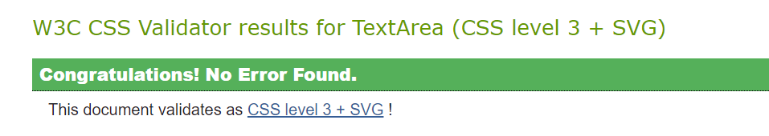

# Testing

- [Code Validation](#code-validation)
- [Testing Functionality](#testing-functionality)
- [Testing Responsiveness](#testing-responsiveness)
- [Testing Performance](#testing-performance)
- [Testing User Stories](#testing-user-stories)

---

## **Code Validation**

- I used [W3C Markup Validation Service](https://validator.w3.org/#validate_by_input) to test the index.html page which returned no errors as shown below:

- I used [Jigsaw CSS Validation Service](https://jigsaw.w3.org/css-validator/validator) to test the style.css code which returned no errors as shown below:

- I used [JsHint](https://jshint.com/) to test the email.js, map.js and script.js code which returned the following:

  - Two undefined variables (emailjs and $) - These were not changed as $ relates to the JQuery used and the emailjs is taken from the EmailJs documentation and will not work without this variable as used.
  - One unused variable (sendEmail) - This is a function being called from the index.html which therefore throws up an error here.

  - One undefined variable (google) - This was not changed as the code was taken from the Google Maps API documentation and will not work without the variable as used.
  - Two unused variables (marker and initMap) - This was not changed as the code was taken from the Google Maps API documentation and will not work without the variables as used.

  - One undefined variable ($) - This was not changed as it relates to the JQuery used.
  - Three unused Variables (dailyQuote, plusSlides, buttonClick) - These are functions being called from the index.html which therefore throws up an error here.

---

## **Testing Functionality**

Testing was done on all the features of the website to make sure everything worked as expected as detailed below

1. Navigation bar

    1. The logo was checked to make sure it takes user back to top of page when clicked
    2. Each navigation link was checked to make sure it brings user to relevant section on page when clicked
    3. Each link was checked to see if text color changes once the user hovers over it

2. Hero Image

    1. The image was checked to make sure it covers full view height
    2. Confirmed the intro text slides as expected 
    3. Both call to action buttons checked to make sure they bring user to relevant section on page once clicked
    4. Each button was checked to see if text color changes once the user hovers over it

3. About me section

    1. The profile image was checked to make sure it was on view and looked good quality
    2. The about me button was clicked to make sure it reveals information about owner as expected
    3. Confirmed the click me button revealed the random quote as expected
    4. The buttons were checked to see if text color changes once the user hovers over it

4. Image section

    1. The images were checked to make sure on view at right size and good quality
    2. Confirmed the right and left arrows both worked as expected on sliding through images

5. Testimonial section

    1. The individual images were check to make sure they were correct size and good quality
    2. Confirmed the right and left arrows both worked as expected on sliding through the testimonials

6. Video section
 
    1. The video was checked it was displayed correctly
    2. Confirmed on clicking video it opens in new browser tab

7. Packages section
  
    1. Checked that both packages are displayed as expected
    2. Confirmed on clicking first more button it adds relevant content as expected and button disappears
    3. Confirmed on clicking second more button it adds relevant content as expected and button disappears

8. Contact section

    1. Checked the contact form with relevant fields are present
    2. Confirmed the name input is required from the user before submitting
    3. Confirmed the email input is required from the user before submitting
    4. Confirmed the contact number input is required from the user before submitting
    5. Checked one radio button is required to be clicked before submitting
    6. Confirmed the enter details input is required from the user before submitting
    7. Confirmed on submitting button an acknowledgment message is displayed
    8. Confirmed the email has been sent to owner email as expected with details provided by user as below

9. Footer

    1. Checked the business name, address, email and contact number all present
    2. Confirmed social media links open new tab once clicked to relevant website
    3. The icons were checked to see if color changes once the user hovers over it
    4. Confirmed Google map displays on all relevant website paths
    5. Confirmed marker is displaying business address and map is interactive

---

## **Testing Responsiveness**

- **Device testing**

The website was tested using Google Chrome's Dev Tools to check if the website displayed well on all devices below:

  1. Moto G4
  2. Galaxy S5
  3. Pixel 2
  4. Pixel 2 XL
  5. iPhone 5/SE
  6. iPhone 6/7/8
  7. iPhone 6/7/8 Plus
  8. iPhone X
  9. iPad
  10. iPad Pro
  11. Surface Duo
  12. Galaxy Fold

_Results were good and as expected_

- **Operating system testing**

The website was tested on real devices with the following OS:

  1. Windows 10
  2. Android
  3. iOS

_Results were good and as expected_

- **Browser testing**

The website was tested on the following browsers:

  1. Google Chrome
  2. Microsoft Edge
  3. Mozilla Firefox
  4. Opera
  5. Vivaldi
  6. Brave

_Results were good and as expected_

---

## **Testing Performance**

Google Chrome's Dev tools were used on an incognito page to check the performance of the website, via their built in lighthouse tool and over all I was satisfied. See below for both desktop and mobile results:

***Mobile Results***

***Desktop Results***

---

## **Testing User Stories**

- I would like a simple yet professional looking website that is visually appealing
  
  - On first entering the website the user is met with an eye-catching hero image with little text to not distract the user. The rest of the website matches to give a nice flow as the user scrolls down.

- I would like to be able to view the website on any device
  
  - The website has been tested on lots of different sized devices to make sure everything is responsive and the website is displayed well and as expected. A hamburger menu has been implemented on iPads and smaller devices to avoid a cluttered navigation bar.

- I should be able to easily navigate throughout the website 

    - The navigation bar has been fixed to the top so the user can navigate easily to any section as desired. The business logo also brings the user back to top as a user would expect.

- Contact details for the business should be easy to find

    - All the contact details including address, contact number, email and location can be found easily on the footer. A contact form is also easily found through the navigation link for users to contact directly.

- I would like to be able to see previous work done

  - An image slideshow is present for users to see photographs and an Instagram video is present, which brings the user to the business owners Instagram where the user can explore more videos if needed.

- I would like a clear explanation of what services are provided

  - A packages section shows the two different services available and buttons to find out more about them.

- Testimonials of previous customers should be provided

  - A testimonial section is added where the user can easily click through them with the arrows provided

- Social media links should be provided for more information

  - On the footer there is the social media links the user can click on and once clicked will open up in new tabs

- A map with the business location so it's easy to find

  - On the footer there is a location map added using Google API to show the user the business location. This is interactive to the user.
- To learn about the business

  - There is an about me section where the user is provided with the business owner profile picture and a button if they want to learn more about the business.

- Any links clicked should open in a new tab

  - All social media links and Instagram video all open in a new tab to make sure the user doesn't lose access to the website and get lost in social media.

- I would like to be able to tell if the service provided is reliable

  - By including testimonials the user can read previous user experience in order to sense their reliability and social media links give users the power to investigate more if needed
